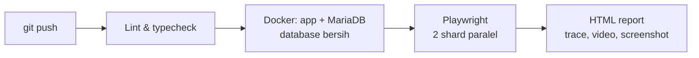

# PARTAMBUS: Portofolio QA

[](https://github.com/rachelsa26/partambus/actions/workflows/e2e.yml)

PARTAMBUS adalah aplikasi **POS (kasir) dan manajemen toko retail**: produk multi-satuan, penjualan, pembelian, stok, sesi kas, laporan, dan hak akses owner/kasir.
Repositori ini adalah **portofolio Quality Assurance** saya: aplikasi nyata yang diuji dari tampilan, API, database, sampai performa, dan semuanya berjalan otomatis di CI.

## Cakupan pengujian

| Lapisan | Tool | Status | Isi |
| --- | --- | --- | --- |
| UI end-to-end | Playwright + TypeScript | ✅ 49 test | Login, hak akses (RBAC), produk, kasir (POS), sesi kas, keamanan dasar. Detail: [`e2e/README.md`](e2e/README.md) |
| API / HTTP | Postman + Newman | 🚧 Dikerjakan | Kontrak endpoint, CSRF, idempotensi checkout, akses per role |
| Database | SQL + runner Node | 🗓️ Direncanakan | Integritas ledger stok, total penjualan vs item, sesi kas, constraint |
| Performance | k6 | 🗓️ Direncanakan | Load, stress, dan race condition checkout serentak |

## Cara kerja otomasi



Setiap push, pull request, dan setiap malam (02:00 WIB), GitHub Actions membangun aplikasi dari nol di Docker lalu menjalankan seluruh test.

Beberapa keputusan desain:

- **UI action lalu cek database.** Test kasir tidak berhenti di "halaman sukses"; test juga memastikan tabel `sales`, `payments`, dan ledger stok tercatat benar.
- **Login lewat HTTP untuk setup**, form login hanya diuji di test login. Lebih cepat, dan setiap test mendapat sesi PHP sendiri (keranjang kasir disimpan di sesi).
- **Aman untuk paralel.** Data uji dibuat unik per test; stok diverifikasi dari baris ledger milik transaksi itu sendiri.
- **Bug yang diketahui = `test.fail()`.** Test tetap hijau selama bug ada, lalu otomatis menjadi penjaga regresi saat bug diperbaiki.

## Temuan

Temuan lengkap (severity, langkah, status) ada di [`e2e/README.md`](e2e/README.md#temuan-selama-pengujian). Ringkasnya: 1 critical (sudah diperbaiki), 1 medium (open redirect), beberapa temuan low, UX, dan aksesibilitas.

## Teknologi

- **Aplikasi:** PHP 8.3, Apache, MariaDB 11.4, PhpSpreadsheet
- **Testing:** Playwright, TypeScript, mysql2, ESLint (`eslint-plugin-playwright`), Prettier
- **Lingkungan & CI:** Docker Compose, GitHub Actions

## Menjalankan

Butuh Docker Desktop dan Node.js 20+.

```bash
docker compose up -d --build --wait    # aplikasi test: http://localhost:8080
cd e2e
npm ci
npx playwright install chromium
npx playwright test                    # semua test
npx playwright show-report             # buka laporan
```

Mode coding sehari-hari (aplikasi di port 8000 + Adminer) dijelaskan di [`DOCKER.md`](DOCKER.md).

## Penulis

**Elsa Rachel Dementieva** · [github.com/rachelsa26](https://github.com/rachelsa26)
