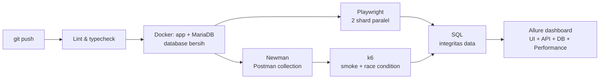

# PARTAMBUS: Portofolio QA

[](https://github.com/rachelsa26/partambus/actions/workflows/e2e.yml)

PARTAMBUS adalah aplikasi **POS (kasir) dan manajemen toko retail**: produk multi-satuan, penjualan, pembelian, stok, sesi kas, laporan, dan hak akses owner/kasir.
Repositori ini adalah **portofolio Quality Assurance** saya: aplikasi nyata yang diuji dari tampilan, API, database, sampai performa, dan semuanya berjalan otomatis di CI.

## Cakupan pengujian

| Lapisan | Tool | Status | Isi |
| --- | --- | --- | --- |
| UI end-to-end | Playwright + TypeScript | ✅ 49 test | Login, hak akses (RBAC), produk, kasir (POS), sesi kas, keamanan dasar. Detail: [`e2e/README.md`](e2e/README.md) |
| API / HTTP | Postman + Newman | ✅ 56 request, 133 assertion | Login & cookie sesi, CSRF, endpoint JSON kasir, idempotensi checkout, sesi kas, void, akses per role. Detail: [`api-tests/`](api-tests) |
| Database | SQL + runner Node | ✅ 30 test | 20 cek integritas data (ledger stok, penjualan, pembayaran, sesi kas) + 10 cek constraint, dijalankan setelah test API dan UI. Detail: [`db-tests/`](db-tests) |
| Performance | k6 | ✅ 4 skenario | Smoke, load (10 kasir: p95 28 ms, 0% error, 496 transaksi), stress (50 kasir), dan race condition: 30 kasir bayar serentak untuk stok 10, harus tepat 10 terjual. Detail: [`perf-tests/`](perf-tests) |

## Cara kerja otomasi



Setiap push, pull request, dan setiap malam (02:00 WIB), GitHub Actions membangun aplikasi dari nol di Docker lalu menjalankan seluruh test UI, API, performa (smoke dan race condition), dan database.

Hasil UI, API, database, dan performa digabung menjadi **satu dashboard Allure Report** (grup `UI`, `API`, `DB`, dan `Performance`), lengkap dengan langkah tiap test.
Laporan per tool tetap tersedia: Playwright HTML report (trace, video, screenshot saat gagal) dan Newman htmlextra.

Beberapa keputusan desain:

- **UI action lalu cek database.** Test kasir tidak berhenti di "halaman sukses"; test juga memastikan tabel `sales`, `payments`, dan ledger stok tercatat benar.
- **Login lewat HTTP untuk setup**, form login hanya diuji di test login. Lebih cepat, dan setiap test mendapat sesi PHP sendiri (keranjang kasir disimpan di sesi).
- **Aman untuk paralel.** Data uji dibuat unik per test; stok diverifikasi dari baris ledger milik transaksi itu sendiri.
- **Performa diukur dengan target, bukan sekadar dicatat.** Setiap skenario k6 punya threshold (misalnya checkout p95 < 1 detik); race condition membuktikan stok tidak pernah terjual melebihi persediaan.
- **Bug yang diketahui = `test.fail()`.** Test tetap hijau selama bug ada, lalu otomatis menjadi penjaga regresi saat bug diperbaiki.

## Temuan

Temuan lengkap (severity, langkah, status) ada di [`e2e/README.md`](e2e/README.md#temuan-selama-pengujian). Ringkasnya: 1 critical (sudah diperbaiki), 3 medium (open redirect, zona waktu transaksi, produk harga Rp0), beberapa temuan low, UX, dan aksesibilitas. Dua temuan medium ditemukan oleh test database.

## Teknologi

- **Aplikasi:** PHP 8.3, Apache, MariaDB 11.4, PhpSpreadsheet
- **Testing:** Playwright, TypeScript, Postman + Newman, k6, mysql2, ESLint (`eslint-plugin-playwright`), Prettier
- **Reporting:** Allure Report 3, Playwright HTML report, newman-reporter-htmlextra, k6 web dashboard
- **Lingkungan & CI:** Docker Compose, GitHub Actions

## Menjalankan

Butuh Docker Desktop, Node.js 20+, dan k6 (`winget install k6 --source winget`).

```bash
docker compose up -d --build --wait    # aplikasi test: http://localhost:8080
cd e2e
npm ci
npx playwright install chromium
npx playwright test                    # semua test
npx playwright show-report             # buka laporan Playwright

cd ../api-tests
npm ci
npm test                               # 56 request API (Newman)

cd ../perf-tests
npm run smoke                          # tes performa singkat (k6)
npm run load                           # load test ±5 menit

cd ../e2e
npm run allure:report                  # gabungkan semua hasil jadi satu dashboard
npm run allure:open
```

Atau semuanya sekaligus (bersihkan hasil lama, test API + UI + performa singkat + database, buat dan buka dashboard): `cd e2e && npm run qa`.

Mode coding sehari-hari (aplikasi di port 8000 + Adminer) dijelaskan di [`DOCKER.md`](DOCKER.md).

## Penulis

**Elsa Rachel Dementieva** · [github.com/rachelsa26](https://github.com/rachelsa26)
